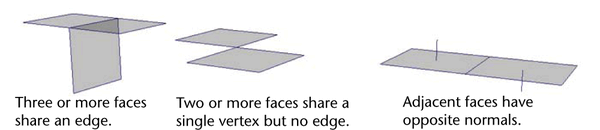

# Non-manifold mesh parts

## Goal

When working with polygonal meshes it is convenient and more efficient to work with so called [manifold](https://en.wikipedia.org/wiki/Manifold) meshes. So our goal for this task is to detect topologically non-manifold mesh parts. This means that we only need to consider mesh connectivity for vertices, edges and faces and can ignore mesh geometry.

## Non-manifold topology

Here are the examples of non-manifold topology that we need to detect in the input mesh:

Opposite normals of adjacent faces mean that the orientation of these faces is not consistent in topological sense.

## Input mesh

For this task input mesh will be triangular mesh, i.e. all its faces will be triangles. The mesh should be loaded from the [OFF file](https://en.wikipedia.org/wiki/OFF_(file_format)), it is a simple text file. No need to support optional parts like comments or colors. Example files with meshes can be found in [example-meshes](./example-meshes) directory.

## Expected result

It is expected that the developed program will find all non-manifold vertices, edges and pairs of faces with inconsistent orientation.

The program should accept single argument: path to the OFF file with triangular mesh.

The result should be printed to `stdout` in the following format:
 
 * number of non-manifold vertices on the first line
 * index of each non-manifold vertex on a separate line
 * number of non-manifold edges
 * two vertex indices for each non-manifold edge on a separate line
 * number of pairs of faces with inconsistent orientation
 * two face indices for each pair on a separate line

## Implementation notes

As a result of the implementation we expect a link to GitHub repository with the code. Any version of C++ can be used, but we prefer the result to be compatible with the latest MSVC version.

For the build configuration we prefer to use CMake, but MSVC solution, QtCreator project or any other build system can also be used. In any case please add read me file with the build instruction even if it is very simple one.

 Any third-party libraries like [VTK](https://vtk.org/), [OpenMesh](https://www.graphics.rwth-aachen.de/software/openmesh/) or [CGAL](https://www.cgal.org/) can be used but in such case some additional steps in the build instruction about the installation of the library are expected.

 ## Feedback

Any questions related to this task can be asked via [creating GitHub issues](../../../issues) for this repository.
